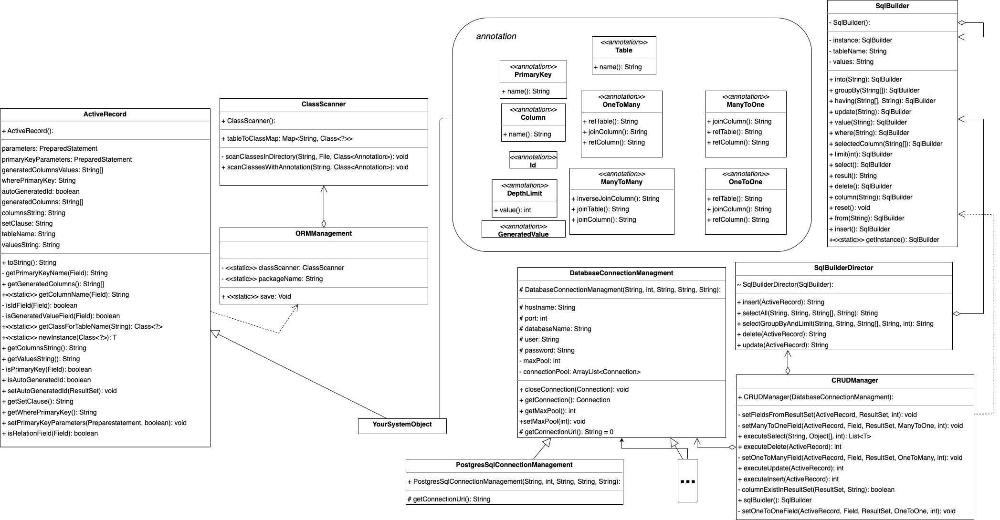

# DAM Framework

A lightweight ORM (Object-Relational Mapping) library for Java projects, simplifying database access and management.

## Table of Contents

- [Installation](#installation)
- [Usage](#usage)
  - [Declaring Models](#declaring-models)
  - [Configuring ORM](#configuring-orm)
  - [Database Connection & CRUD Manager](#database-connection--crud-manager)
  - [Queries](#queries)
- [References](#references)

## Technical Aspects



The DAM Framework follows a modular architecture using various design patterns:

### Active Record Pattern

- The `ActiveRecord` class represents an entity and provides methods for database operations.
- It handles primary key management, auto-generation of fields, and value setting.

### Class Scanner

- The `ClassScanner` scans directories for classes and annotations, mapping tables to Java classes dynamically.

### Annotations

- The framework utilizes custom annotations such as `@Table`, `@PrimaryKey`, `@Column`, `@OneToMany`, `@ManyToOne`, `@ManyToMany`, `@OneToOne`, and `@GeneratedValue` to define ORM mappings.

### ORM Management

- `ORMManagement` oversees the connection between database tables and Java classes.

### Database Connection Management

- `DatabaseConnectionManagement` and `PostgreSqlConnectionManagement` handle connection pooling and database connectivity.

### SQL Builder Pattern

- The `SqlBuilder` class enables dynamic SQL generation for queries like `insert`, `update`, `delete`, `where`, and `select`.
- `SqlBuilderDirector` structures SQL query execution.

### CRUD Manager

- `CRUDManager` provides high-level CRUD operations using `SqlBuilder` and `DatabaseConnectionManagement`.

## Usage

### Installation

1. Use the `DAM-framework.jar` file located in the `jar` folder.
2. Add the relevant JDBC dependency for your database.
3. Import `DAM-framework.jar` into your project.

### Declaring Models

Define your models as Java classes. Example models:

User Model

```java
package org.demo.models;

import org.dam.annotation.*;
import org.dam.mapper.ActiveRecord;

import java.util.Date;
import java.util.List;
import java.util.UUID;

@Table(name = "users")
public class User extends ActiveRecord {
    @PrimaryKey(name = "id")
    @Id
    @GeneratedValue
    private UUID id;

    @Column(name = "email")
    private String email;

    @Column(name = "role")
    private Integer role = 0;

    @Column(name = "display_name")
    private String display_name;

    @Column(name = "avatar_url")
    private String avatarUrl;

    @Column(name = "create_time")
    private Date createdAt;

    @Column(name = "update_time")
    private Date updatedAt;

    @OneToMany(refTable = "reviews", refColumn = "user_id", joinColumn = "id")
    private List<Review> reviews;

    public List<Review> getReviews() {
        return reviews;
    }

    public void setReviews(List<Review> reviews) {
        this.reviews = reviews;
    }

    // set display_name
    public void setDisplayName(String display_name) {
        this.display_name = display_name;
    }

    public User(){}

    public User(
            String email,
            Integer role,
            String display_name,
            String avatarUrl,
            Date createdAt,
            Date updatedAt
    ) {
        this.email = email;
        this.role = role;
        this.display_name = display_name;
        this.avatarUrl = avatarUrl;
        this.createdAt = createdAt;
        this.updatedAt = updatedAt;
    }
}
```

Blog Model

```java
package org.demo.models;

import org.dam.annotation.*;
import org.dam.mapper.ActiveRecord;

import java.util.Date;
import java.util.UUID;

@Table(name = "blogs")
public class Blog extends ActiveRecord {
    @PrimaryKey(name = "id")
    @Id
    @GeneratedValue
    private UUID id;

    @Column(name = "title")
    private String title;

    @Column(name = "content")
    private String content;

    @Column(name = "thumbnail")
    private String thumbnail;

    @Column(name = "create_time")
    private Date createdAt;

    @Column(name = "update_time")
    private Date updatedAt;

    public Blog(UUID id, String title, String content, String thumbnail) {
        this.id = id;
        this.title = title;
        this.content = content;
        this.thumbnail = thumbnail;
    }

    public Blog(String title, String content, String thumbnail) {
        this.title = title;
        this.content = content;
        this.thumbnail = thumbnail;
    }

    public Blog() {
    }

    public void setTitle(String title){
        this.title = title;
    }
}
```

Review Model

```java
package org.demo.models;

import org.dam.annotation.*;
import org.dam.mapper.ActiveRecord;

import java.util.Date;
import java.util.UUID;

@Table(name = "reviews")
public class Review extends ActiveRecord {
    @PrimaryKey(name = "id")
    @Id
    @GeneratedValue
    private UUID id;

    @Column(name = "comment")
    private String comment;

    @Column(name = "rate")
    private Integer rate;

    @OneToOne(refTable = "users", refColumn = "id", joinColumn = "user_id")
    private User user;

    @Column(name = "create_time")
    private Date createdAt;

    @Column(name = "update_time")
    private Date updatedAt;

    public User getUser() {
        return user;
    }
}
```

### Configuring ORM

Specify the package that contains the model classes in your ORM configuration.

```java
public class Main {
    public static void main(String[] args) {
        // SETUP ORM LIBRARY
        ORMManagement.setPackageName("org.demo");
        ORMManagement.save();
    }
}
```

### Database Connection & CRUD Manager

Set up the database connection and use the provided CRUD manager to interact with the database.

```java
 // SETUP DATABASE CONNECTION
DatabaseConnectionManagment dcm = new PostgresSqlConnectionManagement(
        "localhost",
        5432,
        "ticket",
        "postgres",
        "postgres");

CRUDManager cm = new CRUDManager(dcm);
```

### Queries

Perform database operations using built-in methods:

#### Query

```java
// QUERY
List<User> uList = cm.executeSelect(cm.sqlBuidler()
        .select()
        .from("users")
        .limit(2)
        .result(),null, 2);

for(User t: uList){
    for(Review r: t.getReviews()){
        System.out.println(r);
    }
}
```

#### Insert

```java
Blog b = new Blog(
    UUID.fromString("25d9ea5f-5996-4c69-a242-b943a1832d2e"),
    "Test Blog 2",
    "This is a test blog",
    "https://www.google.com"
);

cm.executeInsert(b);
```

#### Update

```java
b.setTitle("Test Blog 2 Updated");
cm.executeUpdate(b);
```

#### Delete

```java
cm.executeDelete(b);
```
